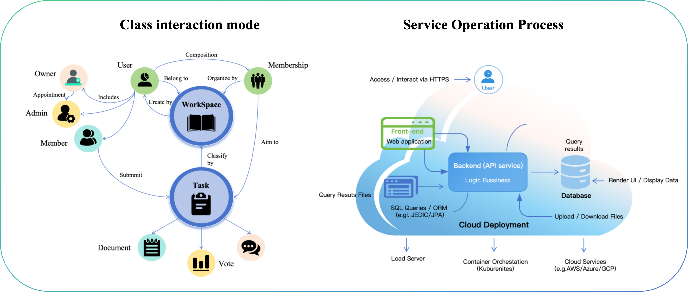

# Collaborative Task Management Platform

[](https://www.oracle.com/java/)
[](https://spring.io/projects/spring-boot)
[](https://www.postgresql.org/)
[](LICENSE)

## 📖 Introduction

The **Collaborative Task Management Platform** is a secure, scalable, and user-centric web application designed to streamline team workflows and enhance productivity for distributed teams.

In an era of remote work and complex cross-functional projects, traditional tools (emails, spreadsheets) often lead to information silos. This platform addresses these challenges by integrating task orchestration, structured team communication, and transparent progress tracking into a unified Single Page Application (SPA).

Built with a robust **Java Spring Boot** backend and a performance-oriented **Vanilla JavaScript** frontend, the system distinguishes itself with a unique **Dual-Status Tracking System** (tracking both individual member progress and overall task completion).


## ✨ Key Features

### 👥 User & Workspace Management
- **Role-Based Access Control (RBAC):** Secure permission model with Owner, Administrator, and Member roles.
- **Collaborative Groups:** create and manage dedicated workspaces for different teams or projects.
- **Invitation System:** Email-based invitations for secure member onboarding.

### 📝 Multi-Type Task System
Unlike generic to-do lists, our platform supports specific task contexts:
- **Basic Tasks:** Standard deliverables with due dates and priorities.
- **Document Tasks:** Tasks requiring file submissions and review.
- **Poll/Vote Tasks:** Facilitate team decision-making directly within the workflow.
- **Discussion Tasks:** Threaded conversations linked to specific topics.

### 📊 Advanced Progress Tracking
- **Personal vs. Global Status:** innovative separation of concerns where a user tracks their own progress (e.g., "Started", "Finished") independently of the task's global lifecycle.
- **Dashboard:** A unified view of tasks filtered by assignee, due date, priority, or status.

### 🛡️ Security & Architecture
- **JWT/Session Management:** Comprehensive authentication via Spring Security.
- **Data Integrity:** PostgreSQL with ACID transactions.
- **Layered Architecture:** Strict separation of concerns (Controller-Service-Repository) using DTOs to decouple API from database entities.

## 🛠️ Tech Stack

### Backend
- **Language:** Java 21 (JDK)
- **Framework:** Spring Boot 3.x
- **Core Modules:** Spring Web MVC, Spring Security, Spring Data JPA, Spring AOP
- **Database:** PostgreSQL
- **ORM:** Hibernate (Inheritance mapping for polymorphic tasks)
- **Build Tool:** Gradle
- **Utilities:** Jackson (JSON), JavaMailSender (Email)

### Frontend
- **Core:** HTML5, CSS3, Vanilla JavaScript (ES6+)
- **Architecture:** Single Page Application (SPA)
- **Design:** User Interface designed in Figma following Nielsen’s usability heuristics.
- **Tools:** VS Code.

## 🏗️ System Architecture

The project follows a **Three-Tier Architecture** to ensure maintainability and scalability:

1.  **Presentation Layer (Client):** Handles UI rendering and state management.
2.  **Controller Layer (API):** RESTful endpoints that accept requests and return DTOs.
3.  **Service Layer (Business Logic):** Transactional logic, validation, and complex workflows.
4.  **Data Access Layer (Repository):** Interface with PostgreSQL via Spring Data JPA.

> **Note on DTOs:** We strictly use Data Transfer Objects (DTOs) for API communication to prevent over-fetching, circular references, and leakage of sensitive database fields.

## 🚀 Getting Started

### Prerequisites
- JDK 21+
- PostgreSQL 14+
- Gradle (or use the provided `gradlew` wrapper)

### Installation

1.  **Clone the repository**

2.  **Configure the Database**
    - Create a PostgreSQL database named `task_db` (or update `application.properties`).
    - Update `src/main/resources/application.properties` with your credentials:
      ```properties
      spring.datasource.url=jdbc:postgresql://localhost:5432/task_db
      spring.datasource.username=your_username
      spring.datasource.password=your_password
      # Mail Configuration (for invitations)
      spring.mail.host=smtp.163.com
      spring.mail.username=your_email@163.com
      spring.mail.password=your_auth_code
      ```

3.  **Build and Run**

    in `running_server` folder
    ```bash
    java -jar demo-0.0.1-SNAPSHOT.jar
    ```

5.  **Access the Application**
    - The backend will start on `http://localhost:8080`.
    - Open the frontend `index.html` (or serve via a simple HTTP server) to interact with the API.

## 🔌 API Documentation Examples

The API follows RESTful principles. Below are examples of key endpoints.

### 1. User's Latest Unfinished Tasks
Retrieves the 5 most recent tasks assigned to the user that are not yet "DONE".
- **Endpoint:** `GET /api/users/{userId}/tasks/latest-unfinished`
- **Response:**
  ```json
  [
    {
      "taskId": 205,
      "title": "Urgent: Fix Login Bug",
      "taskType": "DOCUMENT",
      "status": "IN_PROGRESS",
      "workspace": { "id": 101, "name": "Project A" }
    }
  ]
### 2. Get Task Details
Returns detailed information. The structure adapts based on the taskType (e.g., includes options for VOTES, file info for DOCUMENTS).
- **Endpoint**: `GET /api/tasks/{taskId}`
- **Response** (Vote Task Example):
    ```json
    [
        {
          "taskId": 206,
          "title": "Team Building Location",
          "taskType": "VOTE",
          "options": [
            { "optionId": 10, "content": "Beach", "voteCount": 3 },
            { "optionId": 11, "content": "Mountains", "voteCount": 5 }
          ]
        }
    ]
### 3. Download File
- **Endpoint**: `GET /api/files/download/{fileId}`
- **Headers**: Returns Content-Disposition: attachment.
## 📄 License
This project is licensed under the MIT License - see the LICENSE file for details.
